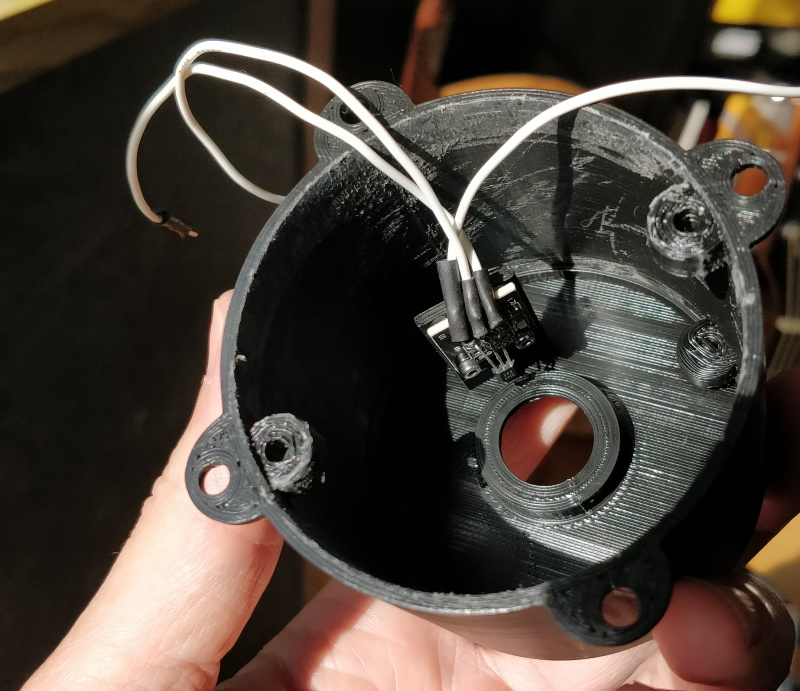

# Solar powered anemometer (Yet another...)

## Forewords

The place where I live is very windy most of the time. I thought it would be fun to make an anemometer by myself.

## Measurement timing

Adjustable in the code. I set it up to one sample of 5s every 15 minutes.

## Specifications

This project is made up of :

* [Hall effect magnetic sensor](https://www.aliexpress.com/item/32433415804.html?spm=a2g0o.productlist.0.0.5d7b6b7bpIWc4B&algo_pvid=c33329b8-6596-40cf-b920-c4147df492a1&algo_expid=c33329b8-6596-40cf-b920-c4147df492a1-2&btsid=0b0a187b15821176341324425ec19b&ws_ab_test=searchweb0_0,searchweb201602_,searchweb201603_)
* [Lithium battery charger module TP4056](https://www.aliexpress.com/item/32797834680.html?spm=a2g0o.productlist.0.0.217e1a3fGgFPtZ&algo_pvid=132d3b0e-1179-4677-b1ea-ac7e339a4b3a&algo_expid=132d3b0e-1179-4677-b1ea-ac7e339a4b3a-0&btsid=0b0a3f8115821175486423616e1e40&ws_ab_test=searchweb0_0,searchweb201602_,searchweb201603_)
* [Wemos D1 Mini (ESP8266 based module)](https://www.aliexpress.com/item/4000015116234.html?spm=a2g0o.productlist.0.0.46c32236A2P9Jw&algo_pvid=ca2d063e-5caa-4a7a-b28f-aab24e4be771&algo_expid=ca2d063e-5caa-4a7a-b28f-aab24e4be771-46&btsid=0b0a0ac215821177182648581e89c9&ws_ab_test=searchweb0_0,searchweb201602_,searchweb201603_)
* Home made voltage divider with 2 resistances 33KOhm and 7.5kOhm
* [Solar panel](https://www.aliexpress.com/item/32327321902.html?spm=a2g0s.9042311.0.0.27424c4dXw694V)
* [XH2.54 connectors](https://www.aliexpress.com/item/32751262161.html?spm=a2g0o.productlist.0.0.73ad7920LACtrI&algo_pvid=59f4dba8-049b-412b-b6ab-2ad6a2a0b251&algo_expid=59f4dba8-049b-412b-b6ab-2ad6a2a0b251-1&btsid=0b0a01f815821181817176811e4e9d&ws_ab_test=searchweb0_0,searchweb201602_,searchweb201603_)
* [30 AWG (0.08mm) silicon wire](https://www.aliexpress.com/item/1000006501735.html?spm=a2g0s.9042311.0.0.27424c4d4oyuHy)
* 3.7v Lithium battery (1200 mAh)
* [Bearing 608ZZ](https://www.aliexpress.com/wholesale?catId=0&initiative_id=SB_20200219052438&SearchText=bearing+608)
* [2 neodymium magnets (8mm)](https://www.aliexpress.com/item/32959402237.html?spm=a2g0o.productlist.0.0.6cb72867YDYB0k&algo_pvid=abf99058-7d96-46d5-b91b-2a17fd93094b&algo_expid=abf99058-7d96-46d5-b91b-2a17fd93094b-1&btsid=0b0a187915821195934654449ebf18&ws_ab_test=searchweb0_0,searchweb201602_,searchweb201603_)

## Wiring

Quite easy : 

* Wire positive and negative 3.7v battery to Wemos (3.3v), Voltage divider, Hall Sensor, TP4056 
* D2 to output of hall effect sensor
* A0 to ouput of voltage divider
* D0 and Reset should be connected (required for deep sleep to work smoothly)

## 3D Models

All 3D models can be found on my [Thingiverse for free](https://www.thingiverse.com/thing:4171003) or in the model3d folder of this project

I included a mount system that fits on H pole like this one : 

If needed, I can provide the 3d model solar panel holder

## In real life

Alive :) : https://www.youtube.com/watch?v=_qRGHen_nGQ

* Sweet 

* In place with solar panel

* Alltogether

* Hall sensor

